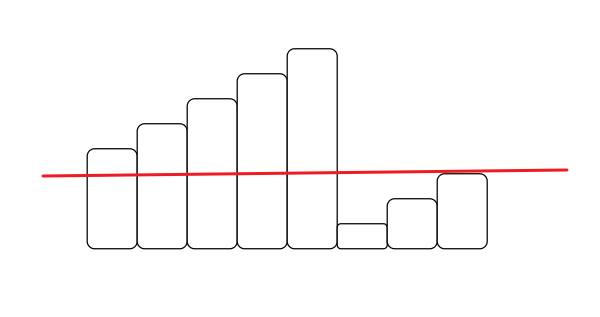

# 二分查找

| 题目                                                         | 题解                                                         | 难度 | 标签     | 时间      | 备注     |
| ------------------------------------------------------------ | ------------------------------------------------------------ | ---- | -------- | --------- | -------- |
| [33. 搜索旋转排序数组](https://leetcode-cn.com/problems/search-in-rotated-sorted-array) | [33. 搜索旋转排序数组](#33-搜索旋转排序数组)                 | 中等 | `二分法` | 2022-3-18 |          |
| [300. 最长上升子序列](https://leetcode-cn.com/problems/longest-increasing-subsequence) | [300. 最长上升子序列](#300-最长上升子序列)                   | 中等 | `二分法` | 2022-3-18 |          |
| [704. 二分查找](https://leetcode-cn.com/problems/binary-search) | [704. 二分查找](#704-二分查找)                               | 简单 | `二分法` | 2022-3-18 | 经典二分 |
| [69. x 的平方根](https://leetcode-cn.com/problems/sqrtx)     | [69. x 的平方根](#69-x 的平方根)                             | 简单 | `二分法` | 2022-3-18 |          |
| [4. 寻找两个正序数组的中位数](https://leetcode-cn.com/problems/median-of-two-sorted-arrays) | [4. 寻找两个正序数组的中位数](#4-寻找两个正序数组的中位数)   | 困难 | `二分法` |           |          |
| [718. 最长重复子数组](https://leetcode-cn.com/problems/maximum-length-of-repeated-subarray) | [718. 最长重复子数组](#718-最长重复子数组)                   | 中等 | `二分法` |           |          |
| [34. 在排序数组中查找元素的第一个和最后一个位置](https://leetcode-cn.com/problems/find-first-and-last-position-of-element-in-sorted-array) | [34. 在排序数组中查找元素的第一个和最后一个位置](#34-在排序数组中查找元素的第一个和最后一个位置) | 中等 | `二分法` | 2022-3-18 |          |
| [153. 寻找旋转排序数组中的最小值](https://leetcode-cn.com/problems/find-minimum-in-rotated-sorted-array) | [153. 寻找旋转排序数组中的最小值](#153-寻找旋转排序数组中的最小值) | 中等 | `二分法` |           |          |
| [240. 搜索二维矩阵 II](https://leetcode-cn.com/problems/search-a-2d-matrix-ii) | [240. 搜索二维矩阵 II](#240-搜索二维矩阵 II)                 | 中等 | `二分法` |           |          |
| [162. 寻找峰值](https://leetcode-cn.com/problems/find-peak-element) | [162. 寻找峰值](#162-寻找峰值)                               | 中等 | `二分法` |           |          |


## 二分查找总结

二分法之所以总是写错，就是一些小细节没处理好。

比如循环判断条件什么时候是`left < right`，什么时候是`left <= right`？区间变化时，是`left = mid`还是`left = mid + 1`？是`right = mid`还是`right = mid - 1`？

所以最首先最核心的点，就是要先确定二分的范围。虽然确定了`left`和`right`，但是`left ~ right`的范围的开闭情况也是要考虑的。

一般要么是左闭右闭，要么是左闭右开。两种情况的经典代码实现如下（`nums`数组升序）。

### 左闭右闭

当`left == right`时，是有意义的，这个数是可取的。所以循环判断条件应该为`left <= right`。

在缩小区间的时候，mid的位置已经确定不可取了，所以区间变化的时候有`left = mid + 1`和`right = mid - 1`。

```Java
public int search(int[] nums, int target) {
    int left = 0, right = nums.length - 1;
    int mid = 0;
    while(left <= right) {
        mid = left + ((right - left) >> 1);
        if(target == nums[mid]) {
            return mid;
        } else if(target > nums[mid]) {
            left = mid + 1;
        }else if(target < nums[mid]) {
            right = mid - 1;
        }
    }
    return -1;
}
```

### 左闭右开

当`left == right`时，是无意义的，因为这个区间无法取到数。所以循环判断条件应该为`left < right`。

在缩小区间的时候，`mid`的位置确定不可取，而`right`的位置是开的，也是不可取的。所以区间变换的时候有`left = mid + 1`和right = mid。

```Java
public int search(int[] nums, int target) {
    int left = 0, right = nums.length;
    int mid = 0;
    while(left < right) {
        mid = left + ((right - left) >> 1);
        if(target == nums[mid]) {
            return mid;
        } else if(target > nums[mid]) {
            left = mid + 1;
        }else if(target < nums[mid]) {
            right = mid;
        }
    }
    return -1;
}
```


------

## 33. 搜索旋转排序数组

[33. 搜索旋转排序数组](https://leetcode-cn.com/problems/search-in-rotated-sorted-array)

因为数组经过旋转，所以不是绝对有序的。但是同样能够找到规律。



它会被分割成两个有序的部分，且左边的最小值大于右边的最大值。通过二分法，可以先找到这个分割点是在`mid`的左边还是右边，再分别使用二分查找找到`target`所在的下标。

### 代码实现

#### 左闭右闭

```Java
public int search1(int[] nums, int target) {
    int left = 0, right = nums.length - 1;
    int mid = 0;
    while (left <= right) {
        mid = left + ((right - left) >> 1);
        if (target == nums[mid]) return mid;
        if (nums[right] > nums[mid]) {
            if (target > nums[mid] && target <= nums[right]) {
                left = mid + 1;
            } else {
                right = mid - 1;
            }
        } else {
            if (target >= nums[left] && target < nums[mid]) {
                right = mid - 1;
            } else {
                left = mid + 1;
            }
        }
    }
    return -1;
}
```

#### 左闭右开

```Java
public int search(int[] nums, int target) {
    int left = 0, right = nums.length;
    int mid = 0;
    while (left < right) {
        mid = left + ((right - left) >> 1);
        if (target == nums[mid]) return mid;
        if (nums[left] < nums[mid]) {
            if (target >= nums[left] && target < nums[mid]) {
                right = mid;
            } else {
                left = mid + 1;
            }
        } else {
            if (target > nums[mid] && target <= nums[right - 1]) {
                left = mid + 1;
            } else {
                right = mid;
            }
        }
    }
    return -1;
}
```


------

## 300. 最长上升子序列

[300. 最长上升子序列](https://leetcode-cn.com/problems/longest-increasing-subsequence)

之前用动态规划做过这道题，能够达到O(n)的时间复杂度。现在用贪心+二分查找来做一遍。

步骤就是，新建一个数组，然后遍历原来的数组。对于遍历的每一个数，会有下边两种情况：

- 遍历到的数比新数组的最后一个数大，那么直接连上去，长度加一
- 遍历到的数不比新数组最后一个数大，那么找到新数组中第一个比它大的，更换

上面第一点容易理解，第二点看到题解里面一个解释说，相当于更小的数比原来的数的价值更大，因为更换后他后面连接的数的下界降低了。这属于是贪心思维来的。

### 代码实现

```Java
public int lengthOfLIS(int[] nums) {
    int len = 1;
    int[] ans = new int[nums.length];
    ans[0] = nums[0];
    for (int i = 1; i < nums.length; i++) {
        if (nums[i] > ans[len - 1]) {
            ans[len++] = nums[i];
        } else {
            int left = 0, right = len;
            int mid = 0;
            // 用来记录要更换的位置，如果没更新，那就是第一个数
            int pos = -1;
            while (left < right) {
                mid = left + ((right - left) >> 1);
                if (nums[i] > ans[mid]) {
                    left = mid + 1;
                    //
                    pos = mid;
                } else {
                    right = mid;
                }
            }
            ans[pos + 1] = nums[i];
        }
    }
    return len;
}
```


------

## 704. 二分查找

[704. 二分查找](https://leetcode-cn.com/problems/binary-search)

最为经典的二分查找。

### 代码实现

```Java
public int search(int[] nums, int target) {
    int left = 0, right = nums.length;
    int mid = 0;
    while (left < right) {
        mid = left + ((right - left) >> 1);
        if (target == nums[mid]) {
            return mid;
        } else if (target > nums[mid]) {
            left = mid + 1;
        } else if (target < nums[mid]) {
            right = mid;
        }
    }
    return -1;
}
```


------

## 69. x 的平方根

同样用二分法，找出`mid * mid <= x`的最大mid。

这里数据可能溢出，所以mid * mid的时候要强转。

### 代码实现

```Java
public int mySqrt(int x){
    if (x < 2) return x;
    int left = 1, right = x;
    int mid = 1;
    while (left < right) {
        mid = left + ((right - left) >> 1);
        if ((long) mid * mid > x) {
            right = mid;
        } else if ((long) mid * mid < x) {
            left = mid + 1;
        } else {
            return mid;
        }
    }
    return 0;
}
```


------

## 4. 寻找两个正序数组的中位数


------

## 718. 最长重复子数组


------

## 34. 在排序数组中查找元素的第一个和最后一个位置

#### [34. 在排序数组中查找元素的第一个和最后一个位置](https://leetcode-cn.com/problems/find-first-and-last-position-of-element-in-sorted-array/)

用二分法，找到第一个比target大的位置和第一个比target+1大的位置，然后再做一些特殊情况的判断，就能得到最后答案。

之前的二分法找的是等于target，现在找的是第一个大于target。以后可能还会有更多情况，遇到其他情况时，循环判断和区间更改要做出相应的变化。

### 代码实现

```Java
public int[] searchRange(int[] nums, int target) {
    int ans1 = search(nums, target);
    int ans2 = search(nums, target + 1);
    if (nums.length == 0 || nums[ans1] != target) return new int[]{-1, -1};
    // 有可能找不到大于等于target+1的，那么就是数组最后一个位置
    return new int[]{ans1, nums[ans2] == target ? ans2 : ans2 - 1};
}

public int search(int[] nums, int target) {
    int left = 0, right = nums.length - 1;
    int mid = left;
    // 第一个大于等于target，从最后一个来开始找
    int ans = right;
    while (left <= right) {
        mid = left + ((right - left) >> 1);
        if (target > nums[mid]) {
            left = mid + 1;
        } else if (target <= nums[mid]) {
            // 要找的是大于等于target的，所以就在这个分支里赋值，最后一个就是第一个
            ans = mid;
            // 要先保存再变化区间，变化之后的right可能就不满足了
            right = mid - 1;
        }
    }
    return ans;
}
```


------

## 153. 寻找旋转排序数组中的最小值


------

## 240. 搜索二维矩阵 II


------

## 162. 寻找峰值


------

