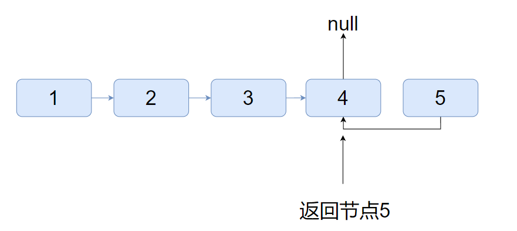
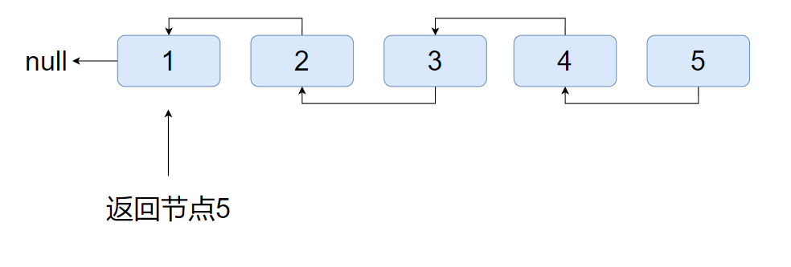

# 链表

| 题目                                                         | 题解                                         | 难度 | 标签     | 时间      | 备注 |
| ------------------------------------------------------------ | -------------------------------------------- | ---- | -------- | --------- | ---- |
| [206. 反转链表](https://leetcode-cn.com/problems/reverse-linked-list) | [206. 反转链表](#206-反转链表)               | 简单 |          | 2022-3-19 |      |
| [25. K 个一组翻转链表](https://leetcode-cn.com/problems/reverse-nodes-in-k-group) | [25. K 个一组翻转链表](#25-K个一组翻转链表)  | 困难 |          | 2022-3-19 |      |
| [21. 合并两个有序链表](https://leetcode-cn.com/problems/merge-two-sorted-lists) | [21. 合并两个有序链表](#21-合并两个有序链表) | 简单 |          | 2022-3-19 |      |
| [141. 环形链表](https://leetcode-cn.com/problems/linked-list-cycle) | [141. 环形链表](#141-环形链表)               | 简单 | 快慢指针 | 2022-3-19 |      |
| [160. 相交链表](https://leetcode-cn.com/problems/intersection-of-two-linked-lists) | [160. 相交链表](#160-相交链表)               | 简单 |          | 2022-3-19 |      |
| [23. 合并K个排序链表](https://leetcode-cn.com/problems/merge-k-sorted-lists) |                                              |      |          |           |      |
| [92. 反转链表 II](https://leetcode-cn.com/problems/reverse-linked-list-ii) |                                              |      |          |           |      |
| [142. 环形链表 II](https://leetcode-cn.com/problems/linked-list-cycle-ii) |                                              |      |          |           |      |
| [143. 重排链表](https://leetcode-cn.com/problems/reorder-list) |                                              |      |          |           |      |
| [19. 删除链表的倒数第N个节点](https://leetcode-cn.com/problems/remove-nth-node-from-end-of-list) |                                              |      |          |           |      |

## 206. 反转链表

[206. 反转链表](https://leetcode-cn.com/problems/reverse-linked-list)

迭代方式容易实现，不做过多说明。

```Java
public ListNode reverseList1(ListNode head) {
    if (head == null) return head;
    ListNode last = null;
    ListNode next = null;
    while (head.next != null) {
        next = head.next;
        head.next = last;
        last = head;
        head = next;
    }
    head.next = last;
    return head;
}
```

递归方式稍微抽象。

首先一直往最后一个节点递归，当`next`节点为`null`时，返回当前节点作为最终结果的头节点。

而在返回递归上一层的时候，将该节点的`next`的`next`指向自己，再将自己的`next`指向`null`。会有如下的效果。





将自己的`next`指向`null`是为了使原来的头节点最终指向`null`。

```Java
public ListNode reverseList(ListNode head) {
    if (head == null || head.next == null) return head;
    ListNode ans = reverseList(head.next);
    head.next.next = head;
    // 以达到原来的头节点的next指向null
    head.next = null;
    return ans;
}
```


------

## 25. K个一组翻转链表

[25. K 个一组翻转链表](https://leetcode-cn.com/problems/reverse-nodes-in-k-group)

模拟题，没有什么奇妙的算法，只有亿些细节要注意。

- 翻转后，每个翻转块的第一个节点是原来的链表中的最后一个节点，而指向下一个翻转块的节点是原来的第一个节点。
- 先判断能否凑成一个K大小的翻转块，再进行翻转。
- 遇到不能凑成翻转块要返回结果的时候，记得把这剩下的也连上去。

```Java
public ListNode reverseKGroup(ListNode head, int k) {
    if(k==1) return head;
    ListNode last = null;
    ListNode next = null;
    ListNode ans = null;
    ListNode cur = head;
    ListNode hair = null;
    ListNode hairCpy = null;
    while(cur!=null){
        ListNode tmp = cur;
        last = null;
        for(int i=0;i<k;i++){
            if(tmp==null){
                if(ans==null) return head;
                hair.next = cur;
                return ans;
            }
            tmp = tmp.next;
        }
        for(int i=0;i<k;i++){
            next = cur.next;
            if(i==0) {
                hairCpy = cur;
            }else if(i==k-1){
                if(hair!=null) hair.next = cur;
                if(ans==null) ans = cur;
                hair = hairCpy;
            }
            cur.next = last;
            last = cur;
            cur = next;
        }
    }
    return ans;
}
```

我为我写出这和屎一样的代码感到羞愧，几乎就是缝缝补补。这边发现有问题就改一下，那边发现有问题改一下。到最后发现改着改着能通过了，但是代码却一点也看不懂了。注释也写不了了。

但是不想改了，开摆🥰


------

## 21. 合并两个有序链表

```Java
public ListNode mergeTwoLists(ListNode list1, ListNode list2) {
    ListNode ans = new ListNode();
    ListNode cur = ans;
    while (list1 != null && list2 != null) {
        if (list1.val < list2.val) {
            cur.next = list1;
            list1 = list1.next;
        } else {
            cur.next = list2;
            list2 = list2.next;
        }
        cur = cur.next;
    }
    cur.next = list1 == null ? list2 : list1;
    return ans.next;
}
```

------

## 141. 环形链表

快慢指针，`fast`每次走两步，`slow`每次走一步，如果有环就会遇到。

因为循环判断条件是`fast != slow`，所以初始化`fast`和slow`就`分别是各走一次的结果，那么还得判断一下特殊情况`head`或`head.next`为空。

```Java
public boolean hasCycle(ListNode head) {
    if (head == null || head.next == null) return false;
    ListNode fast = head.next.next;
    ListNode slow = head.next;
    while (fast != slow) {
        if (fast == null || fast.next == null) return false;
        fast = fast.next.next;
        slow = slow.next;
    }
    return true;
}
```

------

## 160. 相交链表

两个指针，当一个走到null时，指向另一个的头重新走。这样直到最后两个指针走的距离都是两个链表的长度之和，所以一定会相遇。

如果相遇时同时指向null，就是没有相交，否则就是相交在第一次相遇的节点。

```Java
public ListNode getIntersectionNode(ListNode headA, ListNode headB) {
    ListNode a = headA, b = headB;
    while (a != b) {
        a = a.next;
        b = b.next;
        if(a == b) return a;
        if (a == null) a = headB;
        if (b == null) b = headA;
    }
    return a;
}
```

