# 字符串

| 题目                                                         | 题解                                               | 难度 | 标签  | 时间      | 备注        |
| ------------------------------------------------------------ | -------------------------------------------------- | ---- | ----- | --------- | ----------- |
| [28. 实现 strStr()](https://leetcode-cn.com/problems/implement-strstr/) | [28.实现strStr()](#28-实现strStr)                  | 简单 | `KMP` | 2022.3.17 | 经典手撕KMP |
| [459. 重复的子字符串](https://leetcode-cn.com/problems/repeated-substring-pattern/) | [459. 重复的子字符串](#459-重复的子字符串)         | 简单 | `KMP` | 2022.3.17 |             |
| [214. 最短回文串](https://leetcode-cn.com/problems/shortest-palindrome/) | [214. 最短回文串](#214-最短回文串)                 | 困难 | `KMP` | 2022.3.17 |             |
| [686. 重复叠加字符串匹配](https://leetcode-cn.com/problems/repeated-string-match/) | [686. 重复叠加字符串匹配](#686-重复叠加字符串匹配) | 中等 | `KMP` | 2022.3.17 |             |
| [面试题 17.17. 多次搜索](https://leetcode-cn.com/problems/multi-search-lcci/) | [面试题 17.17. 多次搜索](#面试题%2017.17-多次搜索) | 中等 | `KMP` | 2022.3.17 |             |


## KMP算法

在字符串匹配问题中，如果使用暴力法，对主串的每一个字符都作为匹配的字符串的开头来考虑，那么平均时间复杂度会达到`O(n^2)`。

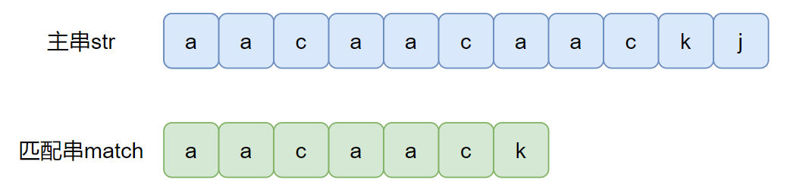

为了能够用`O(n)`的时间复杂度来解决字符串匹配问题，就要使用KMP算法。

而在KMP算法的实现过程中，最核心的就是关于匹配串`match`的`next`数组。

### 什么是`next`数组？

对于字符串上的任意一位，位于其前面的字符所构成的字符串的最长相等前后缀，就是该位上`next`的值。

以匹配串`aacaack`为例，观察其最后一位，那么位于其前面的字符构成的字符串就是`aacaac`。设每次取前后缀长度为`t`，那么有：

- 当`t=1`时，前缀为`a`，后缀为`c`，前后缀不相等
- 当`t=2`时，前缀为`aa`，后缀为`ac`，前后缀不相等
- 当`t=3`时，前缀为`aac`，后缀为`aac`，前后缀相等，那么目前长相等前后缀为`3`
- 当`t=4`时，前缀为`aaca`，后缀为`caac`，前后缀不相等
- 当`t=5`时，前缀为`aacaa`，后缀为`acaac`，前后缀不相等
- 当`t=6`时，前缀和后缀是同一个同一个部分的字符串，不考虑

所以在该字符串`k`的位置上的`next`值就是`3`。

特别的，规定位置`0`上面的`next`值为`-1`，因为`0`位置前面无法构成字符串。而位置`1`上的`next`值为`0`，因为该位置前面只有一个字符，不考虑。

按照这种规定，那么能够得到字符串`aacaack`的`next`值。

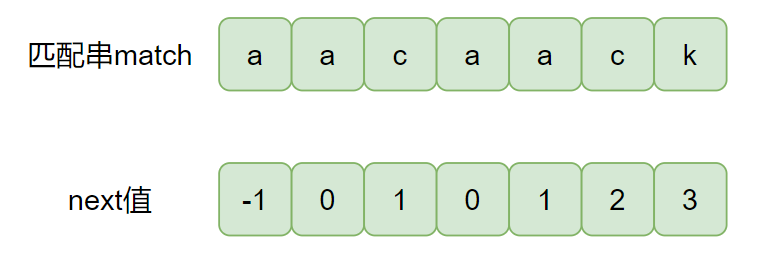

### 怎么用`next`数组？

得到匹配串的`next`数组之后，要怎么将其用在字符串匹配上呢？

一开始的匹配过程，和暴力法的第一轮匹配是一样的。主串`str`和匹配串`match`同时从第一个字符开始遍历，直到两个字符串中的某一个位置不相等。

然后将匹配串的下标跳转到其该位置上的`next`值所指向的下标，继续匹配，直到匹配成功。

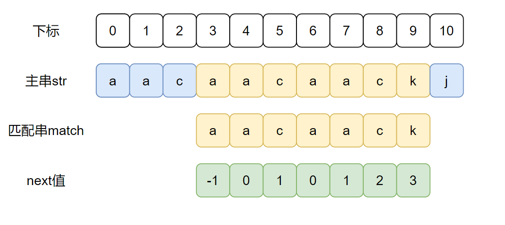

匹配过程代码实现如下：

```java
public int getIndexOf(char[] str, char[] match) {
    if(match.length < 1 || str.length < match.length) {
        return -1;
    }
    int x = 0, y = 0;
    int[] next = getNextArray(match);
    while(x < str.length && y < match.length) {
        if(str[x] == match[y]) {
            x++;
            y++;
        } else if(next[y] == -1) {
            // 首先找到str中第一个和match[0]的字符位置
            x++;
        } else {
            y = next[y];
        }
    }
    return y == match.length ? x - y : -1;
}
```

在这个`while`循环中的时间复杂度为`O(n)`。

### 怎么求`next`数组？

现在已经直到`next`数组是什么，以及怎么用`next`数组了，最后就是怎么求`next`数组了。

在这之前，可以预先知道，对于某个位置`i`上的`next`值`next[i]`如果大于`0`，那么位置`i-1`上的`next`值`next[i-1]=next[i]-1`。

首先按照前面规定，`0`位置上是`-1`，`1`位置上是`0`。

那么一般的，我们接下来求位于位置`i(i>1)`上的`next`值，也就是求位置`0~i-1`上的字符构成的字符串的最长相等前后缀。此时会有多种情况：

我们先来看第一种情况，假设现在要求下标为`15`的位置上的`next`值。

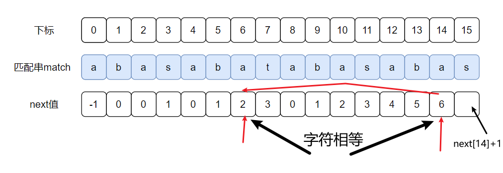

因为要求的是最长相等前后缀，而`next[14]`的值就是前一个位置上的最长相等前后缀，也就是绿色框中的字符串相等。那么假设现在不清楚字符的情况，下标`15`的位置上可能的最长相等前后缀就是前一个`next`值加上`1`。也就是绿色框内的字符串各加上一个字符。所以只要红色框内的字符相等，就满足这种情况。

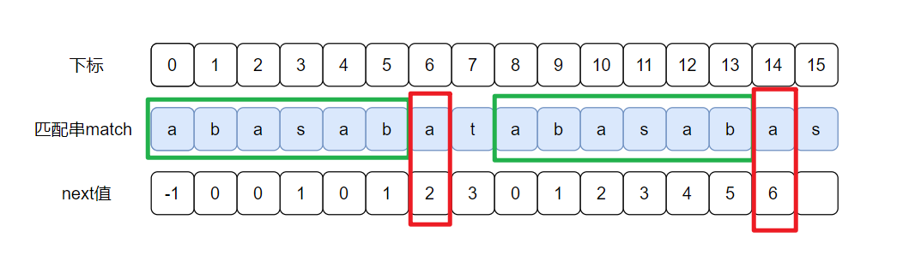

上面这种情况是最大的可能性就是`next`值的情况，那么如果红色框内的字符不相等，又会是怎么计算呢？

下面来看第二种情况，假设现在要求下标为`16`位置上的`next`值。

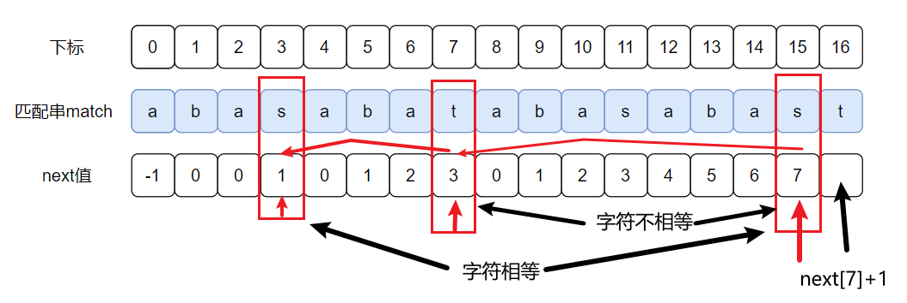

在这里一开始和第一种情况一样，先检查下标`15`的字符和下标`next15]=7`的字符是否相等，但是这里不相等。接下来的话就要检查下标`15`的字符和下标`next[7]=3`的字符是否相等，可以发现这里同样都是`s`，相等，所以`next[16]=next[7]+1`。也就是说，一直往回走，直到发现字符相等。

一般的，在这里我们假设我们要检查是否和下标`i-1`上的字符相等的字符下标为`x`，那么一开始有`x=next[i-1]`。查看下标为x的字符和下标为`i-1`的字符是否相等。如果不相等，就会让`x=next[x]`。直到发现下标`x`上的字符和`i-1`上的字符相等，就赋值`next`值为`next[i]=x+1`。

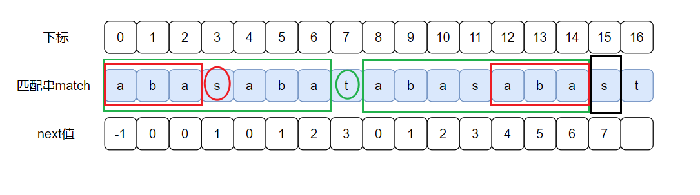

上面两种情况都是能找到相等字符的，那如果始终找不到相等字符又该怎么处理呢？

第三种情况，假设现在要求下标为`16`位置上的`next`值

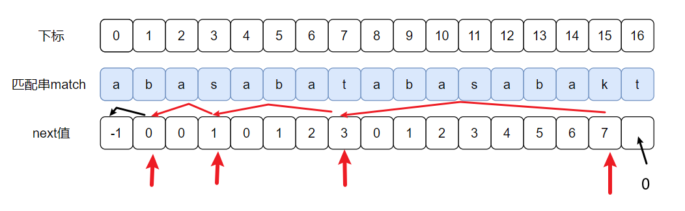

可以发现，直到最后都不能找到相等字符，那么此时就将`next[16]`赋值为`0`。

最后，计算`next`数组代码实现如下

```java
public int[] getNextArray(char[] match) {
    if(match.length == 1) {
        return new int[] { -1 };
    }
    int[] next = new int[match.length];
    next[0] = -1;
    next[1] = 0;
    int i = 2;
    int x = 0;
    while(i < match.length) {
        if(match[i - 1] == match[x]){
            // next[i] = x+1; i++; x++;
            next[i++] = ++x;
        }else if(x > 0) {
            // 直到找到 match[x] == match[i-1] 或 x == 0
            x = next[x];
        }else {
            next[i++] = 0;
        }
    }
    return next;
}
```

注意当某一个下标上求出的`next`值为`0`，此时`x`的值也为`0`。那么下一个位置的`next`值至多为`1`，所以`x`相当于又重头开始看相等前后缀，`x`不用重新赋值。

该函数求`next`数组的时间复杂度为`O(n)`


------

## 28. 实现strStr()

[28. 实现strStr()](https://leetcode-cn.com/problems/implement-strstr/)

虽然这是一道简单题可以直接暴力模拟，但是时间复杂度就会达到O(MN)，所以用KMP来达到O(N)的程度。

### 代码实现

```Java
public int strStr(String haystack, String needle) {
    if (needle.length() > haystack.length()) return -1;
    if (needle.length() == 0) return 0;
    int[] next = getNextArray(needle);
    int i = 0;
    int j = 0;
    while (i < haystack.length() && j < needle.length()) {
        if (haystack.charAt(i) == needle.charAt(j)) {
            i++;
            j++;
        } else if (j == 0) {
            // 首先找到str中第一个和match[0]的字符位置
            i++;
        } else {
            j = next[j];
        }
    }
    return j == needle.length() ? i - needle.length() : -1;
}

public int[] getNextArray(String match) {
    if (match.length() == 1) return new int[]{-1};
    int[] next = new int[match.length()];
    next[0] = -1;
    next[1] = 0;
    int i = 2;
    int x = 0;
    while (i < match.length()) {
        if (match.charAt(i - 1) == match.charAt(x)) {
            // next[i] = x+1; i++; x++;
            next[i++] = ++x;
        } else if (x > 0) {
            // 直到找到 match[x] == match[i-1] 或 x == 0
            x = next[x];
        } else {
            next[i++] = 0;
        }
    }
    return next;
}
```


------

## 459. 重复的子字符串

[459. 重复的子字符串](https://leetcode-cn.com/problems/repeated-substring-pattern/)

因为刚学了`KMP`，所以想着也用`KMP`来解决吧。

对于一个字符串`S`，如果它满足题目要求，那么可以转换成`s's's's's'...s'`，即`n`个`s'`连起来。而把第一个`s'`取出来放在最后，组成的字符串依然是`S`。

而`s'`的长度大于等于`1`，所以将两个`S`连起来，再去除掉第一个和最后一个字符，构成的字符串`S'`会包含`S`。

所以就可以用`KMP`解决。

### 代码实现

```Java
public boolean repeatedSubstringPattern(String s) {
    return kmp(s + s, s);
}

public int[] getNextArray(char[] match) {
    if (match.length == 1) return new int[]{-1};
    int[] next = new int[match.length];
    int i = 2;
    int x = 0;
    while (i < match.length) {
        if (match[i - 1] == match[x]) {
            next[i++] = ++x;
        } else if (x > 0) {
            x = next[x];
        } else {
            next[i++] = 0;
        }
    }
    return next;
}

public boolean kmp(String str, String match) {
    char[] pattern = match.toCharArray();
    int[] next = getNextArray(pattern);
    int i = 1, j = 0;
    // i 范围为 1~str.length-1
    while (i < str.length() - 1 && j < match.length()) {
        if (str.charAt(i) == match.charAt(j)) {
            i++;
            j++;
        } else if (j == 0) {
            i++;
        } else {
            j = next[j];
        }
    }
    return j == match.length();
}
```

事实上，由于`KMP`的时间复杂度中的常数项比较大，再加上这道题又是简单题没有很大的数据量，所以`KMP`并不是最优解。至于其他解法参考官方题解。


------

## 214. 最短回文串

[214. 最短回文串](https://leetcode-cn.com/problems/shortest-palindrome/)

要构成回文串，最傻逼的方式就是把字符串倒过来然后接到前面去，但是这样难以满足’最短‘。

例如下面这种情况，因为本身字符串内就是以一串回文串作为前缀，倒序之后这部分顺序不变。

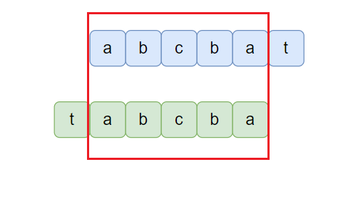

而这一部分回文串，在原字符串中是前缀的存在，在反转后的字符串是后缀的存在，所以接下来要找出反转前的前缀和反转后的后缀相等的最长的情况。

前缀、后缀、相等、最长，这几个关键词是不是和上面KMP算法的next数组的含义有点像？如果我们把反转后的字符串接在原来的字符串后面，那么其实就是求连接后的字符串的最长相等前后缀。

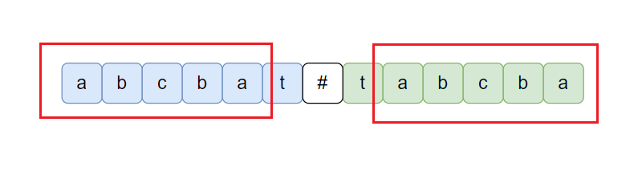

这里中间要用一个非小写英文字母来连接，后面会讲原因。

所以又回到了KMP算法的求next数组，最后再模拟连接就可以了。

### 代码实现

```Java
public String shortestPalindrome(String s){
    if(s.length()<2) return s;
    char[] match = new char[s.length()*2+1];
    for(int i=0;i<s.length()*2;i++){
        match[i] = s.charAt(i);
        match[s.length()*2-i] = s.charAt(i);
    }
    match[s.length()] = '#';
    int[] next = getNextArray(match);
    int maxLen = next[2*s.length()+1];
    StringBuilder sb = new StringBuilder();
    for(int i=0;i<s.length()-maxLen;i++){
        sb.append(match[s.length()+1+i]);
    }
    sb.append(s);
    return sb.toString();
}
public int[] getNextArray(char[] match){
    int[] next = new int[match.length+1];
    next[0] = -1;
    next[1] = 0;
    int i = 2;
    int x = 0;
    while(i<=match.length){
        if(match[i-1]==match[x]){
            next[i++] = ++x;
        }else if(x>0){
            x = next[x];
        }else{
            next[i++] = 0;
        }
    }
    return next;
}
```

至于上面为什么要用一个非小写英文字母来连接呢？因为可能会出现反转连接后最长相等前后缀超过原来字符串的情况。

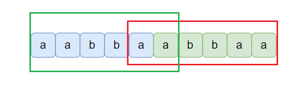

这样就无法实现我们的要求。


------

## 686. 重复叠加字符串匹配

[686. 重复叠加字符串匹配](https://leetcode-cn.com/problems/repeated-string-match/)

同样用KMP算法。

首先题意是要求a串重复的最少次数，那么在匹配的过程中可以重复使用`a`串，同时记录使用的次数。如果使用次数大于`b.length/a.length+3`的话，或者`b`串前面匹配失败重回到第一个字符时次数大于`1`，那么后面就不可能再匹配得到了。

### 代码实现

```Java
public int repeatedStringMatch(String a, String b) {
    return getIndexOf(a, b);
}

public int getIndexOf(String str, String match) {
    int[] next = getNextArray(match);
    int i = 0, j = 0;
    int cnt = 1;
    while (cnt < match.length() / str.length() + 3 && j < match.length()) {
        if (str.charAt(i) == match.charAt(j)) {
            i++;
            j++;
        } else if (j == 0) {
            i++;
        } else {
            j = next[j];
        }
        if (j == 0 && cnt > 1) return -1;
        if (i == str.length() && j < match.length()) {
            i = str.length();
            cnt++;
        }
    }
    return cnt;
}

public int[] getNextArray(String match) {
    if (match.length() == 1) return new int[]{-1};
    int[] next = new int[match.length()];
    next[0] = -1;
    next[1] = 0;
    int i = 2;
    int x = 0;
    while (i < match.length()) {
        if (match.charAt(i - 1) == match.charAt(x)) {
            next[i++] = ++x;
        } else if (x > 0) {
            x = next[x];
        } else {
            next[i++] = 0;
        }
    }
    return next;
}
```

这里面有一些小细节导致我提交好几次错误。比如这个次数`cnt`为什么超过`a/b+3`就不行了？这里类似一个滑动块可以解释。因为实质上是当`b`串又从头开始匹配的时候，如果头超过第一个`a`的长度，就说明后面不会匹配到了。

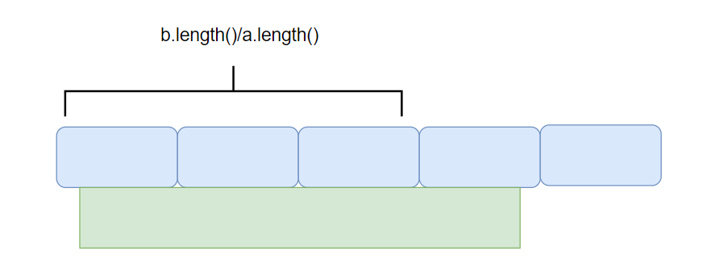

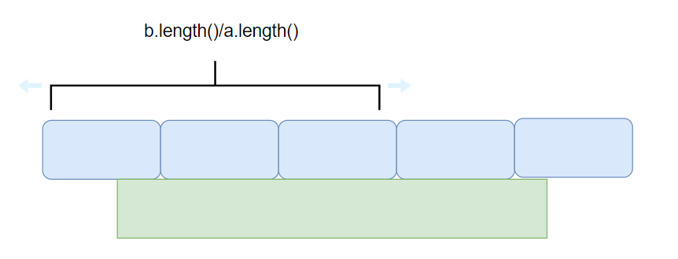

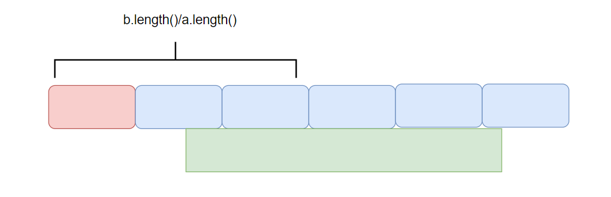

例如上面`b.length/a.length`求出来是`3`，而当`a`串被使用`3+2=5`次的时候，`b`的第一个字符还是包含在第一块`a`中。只有当`a`串被使用`3+3=6`次的时候，才能保证第一块`a`不被使用。


------

## 面试题 17.17. 多次搜索

[面试题 17.17. 多次搜索](https://leetcode-cn.com/problems/multi-search-lcci/)

同样使用KMP算法，对于每一个搜索到匹配的开始下标之后，再从这个下标的下一个位置开始搜索。

### 代码实现

```Java
public int[][] multiSearch(String big, String[] smalls) {
    int[][] ans = new int[smalls.length][];
    for (int i = 0; i < smalls.length; i++) {
        ans[i] = getIndexOf(big, smalls[i]);
    }
    return ans;
}

public int[] getNextArray(String match) {
    if (match.length() == 1) return new int[]{-1};
    int[] next = new int[match.length()];
    next[0] = -1;
    next[1] = 0;
    int i = 2;
    int x = 0;
    while (i < match.length()) {
        if (match.charAt(i - 1) == match.charAt(x)) {
            next[i++] = ++x;
        } else if (x > 0) {
            x = next[x];
        } else {
            next[i++] = 0;
        }
    }
    return next;
}

public int[] getIndexOf(String str, String match) {
    if (match.length() == 0) return new int[0];
    List<Integer> ans = new ArrayList<>();
    int[] next = getNextArray(match);
    int i = 0, j = 0;
    while (i < str.length()) {
        if (str.charAt(i) == match.charAt(j)) {
            i++;
            j++;
        } else if (j == 0) {
            i++;
        } else {
            j = next[j];
        }
        if (j == match.length()) {
            ans.add(i - j);
            i = i - j + 1;
            j = 0;
        }
    }
    int[] res = new int[ans.size()];
    for (i = 0; i < ans.size(); i++) res[i] = ans.get(i);
    return res;
}
```


------

